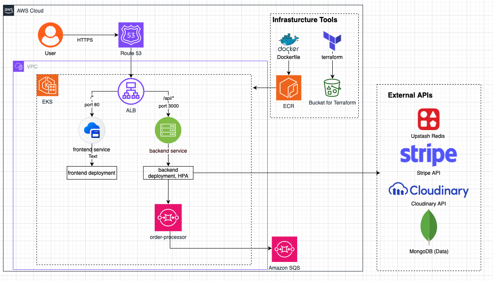

# E-Commerce Store on AWS EKS

A full-stack e-commerce application deployed on AWS EKS (Elastic Kubernetes Service) with complete CI/CD pipeline, Infrastructure as Code, and cloud-native monitoring.


## Architecture



### Architecture Components

| Component                     | Description                                           |
| ----------------------------- | ----------------------------------------------------- |
| **Route 53**                  | DNS management for custom domain                      |
| **Application Load Balancer** | Routes traffic - `/` to frontend, `/api/*` to backend |
| **EKS Cluster**               | Managed Kubernetes cluster with 2 node groups         |
| **Frontend Service**          | React SPA served via Nginx                            |
| **Backend Service**           | Node.js REST API with HPA (Horizontal Pod Autoscaler) |
| **Order Processor**           | Background worker for async order processing          |
| **Amazon SQS**                | Message queue for decoupled order processing          |
| **Amazon ECR**                | Container registry for Docker images                  |
| **S3 Bucket**                 | Terraform state storage                               |
| **CloudWatch**                | Monitoring and alerting                               |
| **External APIs**             | MongoDB Atlas, Upstash Redis, Stripe, Cloudinary      |

---

## Features

### Application Features

- User authentication (signup/login with JWT)
- Product catalog with categories
- Shopping cart functionality
- Stripe payment integration
- Order processing with async queue
- Admin dashboard with analytics
- Coupon/discount system

### DevOps Features

- Fully automated CI/CD pipeline
- Infrastructure as Code with Terraform
- Kubernetes deployments with HPA
- Multi-stage Docker builds
- CloudWatch monitoring and alerting
- Code quality analysis with SonarQube

---

## Tech Stack

### Application

| Layer        | Technologies                                       |
| ------------ | -------------------------------------------------- |
| **Frontend** | React 18, Vite, TailwindCSS, Zustand, React Router |
| **Backend**  | Node.js, Express.js, JWT Authentication            |
| **Database** | MongoDB Atlas (Mongoose ODM)                       |
| **Cache**    | Upstash Redis                                      |
| **Payments** | Stripe API                                         |
| **Media**    | Cloudinary                                         |

### DevOps / Cloud

| Category           | Technologies                                           |
| ------------------ | ------------------------------------------------------ |
| **Container**      | Docker (multi-stage builds)                            |
| **Orchestration**  | Kubernetes (AWS EKS)                                   |
| **Infrastructure** | Terraform                                              |
| **CI/CD**          | GitHub Actions                                         |
| **AWS Services**   | EKS, ECR, ALB, SQS, CloudWatch, SNS, S3, Route 53, ACM |
| **Code Quality**   | SonarQube, Jest, Vitest                                |

---

## Project Structure

```
.
├── backend/                    # Backend API
│   ├── controllers/            # Route handlers
│   ├── lib/                    # External service connections
│   ├── middleware/             # Auth middleware
│   ├── models/                 # Mongoose models
│   ├── routes/                 # API routes
│   ├── workers/                # Background workers
│   └── test/                   # Unit & integration tests
├── frontend/                   # React frontend
│   ├── src/
│   │   ├── components/         # Reusable components
│   │   ├── pages/              # Page components
│   │   ├── stores/             # Zustand stores
│   │   └── lib/                # Utilities
│   └── public/                 # Static assets
├── docker/                     # Docker configurations
│   ├── backend/                # Backend Dockerfile
│   ├── frontend/               # Frontend Dockerfile + nginx
│   ├── order-processor/        # Worker Dockerfile
│   └── docker-compose.yml      # Local development
├── infrastructure/
│   ├── terraform/              # IaC for AWS resources
│   │   ├── eks-cluster.tf      # EKS configuration
│   │   ├── vpc.tf              # VPC and subnets
│   │   ├── iam-alb-controller.tf
│   │   ├── monitoring.tf       # CloudWatch alarms
│   │   └── ...
│   └── kubernetes/             # K8s manifests
│       ├── backend-dep.yaml
│       ├── backend-hpq.yaml    # HorizontalPodAutoscaler
│       ├── frontend-dep.yaml
│       ├── ingress.yaml        # ALB Ingress
│       └── ...
├── .github/workflows/          # CI/CD pipelines
│   ├── cicd.yml                # Main pipeline
│   └── terraform.yml           # Infrastructure pipeline
└── Makefile                    # Automation commands
```

---

## Prerequisites

- **AWS Account** with appropriate permissions
- **AWS CLI** configured with credentials
- **kubectl** v1.28+
- **Terraform** v1.7+
- **Docker**
- **Helm** v3+
- **Node.js** 18+

---

## Quick Start

### 1. Clone the Repository

```bash
git clone https://github.com/yourusername/e-commerce-eks.git
cd e-commerce-eks
```

### 2. Infrastructure Setup

```bash
# Initialize Terraform
make terraform-init

# Preview changes
make terraform-plan

# Create infrastructure (EKS, VPC, etc.)
make terraform-apply
```

### 3. Configure kubectl

```bash
# Update kubeconfig for EKS cluster
make k8s-config
```

### 4. Install AWS Load Balancer Controller

```bash
# Setup Kubernetes basics (namespace, service accounts)
make k8s-setup

# Install ALB Controller via Helm
make alb-controller
```

### 5. Create Secrets

```bash
# Copy example and fill in your values
cp infrastructure/kubernetes/backend-secrets.yaml.example \
   infrastructure/kubernetes/backend-secrets.yaml

# Edit with your actual secrets (base64 encoded)
```

### 6. Deploy Application

```bash
# Deploy all components
make deploy-backend
make deploy-frontend
make deploy-order-processor
make deploy-ingress
```

### 7. Get Application URL

```bash
make get-url
```

---

## CI/CD Pipeline

The project uses GitHub Actions with a 3-stage pipeline:

```
┌─────────────┐     ┌─────────────────┐     ┌──────────────┐
│    Test     │ ──▶ │  Build & Push   │ ──▶ │   Deploy     │
└─────────────┘     └─────────────────┘     └──────────────┘
```

### Stage 1: Test

- Run backend tests (Jest)
- Run frontend tests (Vitest)
- SonarQube code analysis
- Generate coverage reports

### Stage 2: Build & Push

- Build Docker images (backend, frontend, order-processor)
- Tag with commit SHA and `latest`
- Push to Amazon ECR

### Stage 3: Deploy

- Update EKS deployments with new images
- Rolling update with zero downtime
- Verify deployment status

### Triggers

- **Push to `main`**: Full pipeline (test → build → deploy)
- **Push to `dev`**: Test only
- **Pull Request to `main`**: Test only

---

## Monitoring & Alerting

CloudWatch alarms are configured for:

| Alarm             | Threshold    | Description             |
| ----------------- | ------------ | ----------------------- |
| High CPU          | > 80%        | Node CPU utilization    |
| High Memory       | > 80%        | Node memory utilization |
| High Disk         | > 80%        | Node disk utilization   |
| Low Node Count    | < 2          | Minimum healthy nodes   |
| Pod Failures      | > 5 restarts | Container restart count |
| High Latency      | > 2s         | API response time       |
| 5xx Errors        | > 10         | Server error count      |
| Unhealthy Targets | > 0          | ALB target health       |

Alerts are sent via **SNS email notifications**.

---

## Available Commands

```bash
# Terraform
make terraform-init      # Initialize Terraform
make terraform-plan      # Preview infrastructure changes
make terraform-apply     # Apply infrastructure changes
make terraform-destroy   # Destroy all infrastructure
make terraform-output    # Show Terraform outputs

# Kubernetes Setup
make k8s-config          # Configure kubectl for EKS
make k8s-setup           # Create namespace and service accounts
make alb-controller      # Install AWS Load Balancer Controller

# Application Deployment
make deploy-backend      # Deploy backend service
make deploy-frontend     # Deploy frontend service
make deploy-order-processor  # Deploy order processor worker
make deploy-ingress      # Deploy ALB ingress
make deploy-all          # Deploy everything

# Utilities
make status              # Show status of all resources
make get-url             # Get application URL
make logs-backend        # Stream backend logs
make logs-frontend       # Stream frontend logs

# Cleanup
make clean-k8s           # Delete Kubernetes resources
make clean-all           # Destroy everything
```

---

## Local Development

```bash
# Install dependencies
npm install
npm install --prefix frontend

# Start with Docker Compose
cd docker
docker-compose up -d

# Or run directly
npm run dev              # Backend on :3000
npm run dev --prefix frontend  # Frontend on :5173
```

---

## Environment Variables

### Backend

| Variable                | Description               |
| ----------------------- | ------------------------- |
| `MONGO_URI`             | MongoDB connection string |
| `UPSTASH_REDIS_URL`     | Redis connection URL      |
| `ACCESS_TOKEN_SECRET`   | JWT access token secret   |
| `REFRESH_TOKEN_SECRET`  | JWT refresh token secret  |
| `CLOUDINARY_CLOUD_NAME` | Cloudinary cloud name     |
| `CLOUDINARY_API_KEY`    | Cloudinary API key        |
| `CLOUDINARY_API_SECRET` | Cloudinary API secret     |
| `STRIPE_SECRET_KEY`     | Stripe secret key         |
| `SQS_ORDER_QUEUE_URL`   | AWS SQS queue URL         |
| `CLIENT_URL`            | Frontend URL for CORS     |

---

## Testing

```bash
# Run backend tests
npm test

# Run frontend tests
npm test --prefix frontend

# Run with coverage
npm test -- --coverage
npm run test:run --prefix frontend -- --coverage
```

---

## License

MIT License

---

## Author

Built as a portfolio project demonstrating DevOps and Cloud Engineering skills.
